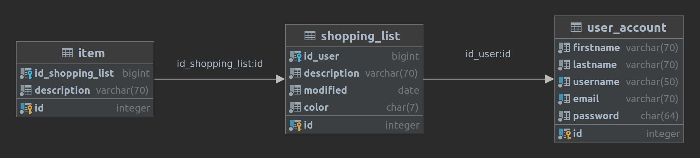

## Domain Description

The domain of the native Android application `Chorlist` consists of managing a list of tasks for purchasing various products.

Users will be able to add products and categorize them into predefined categories - shopping lists. When a user obtains the required product, they mark it, and it disappears from the shopping list. When all products on the shopping list are acquired, the list is automatically deleted. Additionally, if a user prefers to use a paper-based shopping list, the application will enable printing of shopping lists in PDF format, which can then be printed out.

If multiple users want to collectively add products to shopping lists, they can log in with the same user account, and the application will automatically periodically check for changes to their shopping lists.

## Project Specification

### Project Architecture

The diagram illustrates the architecture of the `Chorlist` mobile application at the highest level of abstraction. The first component is the user who will interact with the mobile application, which communicates with `NodeJs` Web service handling data within `MySQL` database.

## Entity-Relationship Diagram

The diagram illustrates the Entity-Relationship diagram of `Chorlist` application. ER diagram consists of three relations: `item`, `shopping_list`, `user_account`.

### Functional Requirements

Label | Name                                      | Brief Description                                                                         |
------|-------------------------------------------|-------------------------------------------------------------------------------------------|
F1    | Registration                              | The system will allow registration for new users.                                         |
F2    | Login                                     | The system will grant access only to authenticated users.                                 |
F3    | Profile                                   | The system will enable editing of user profiles, including logging out.                    |
F4    | Task Management                           | The system will allow adding new tasks and editing and deleting existing ones.             |
F5    | Task Synchronization                     | The system will enable synchronization of tasks among multiple users logged into the same user account. |
F6    | Categorization of Tasks into Shopping Lists | The system will enable organization of tasks by user-defined categories.                |
F7    | Task Search                               | The system will allow searching through all tasks.                                         |
F8    | Widget                                    | The system will enable the creation of widgets - displaying selected shopping lists and adding and deleting tasks. |
F9    | Print Shopping List                      | The system will enable the creation of a PDF document showing shopping lists along with their tasks. |

## Technologies and Equipment

- Android Studio
- Android SDK
- Kotlin
- Git & GitHub
